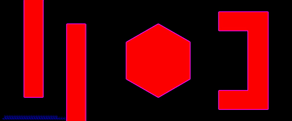

# Path Planning and Robot Navigation for Obstacle Avoidance

*Robot Path planning using Dijkstra, A-Star, and RRT.*

## Results

  
**A-star**

(10,10) is the Start Node and (1150,50) is the Goal Node.
