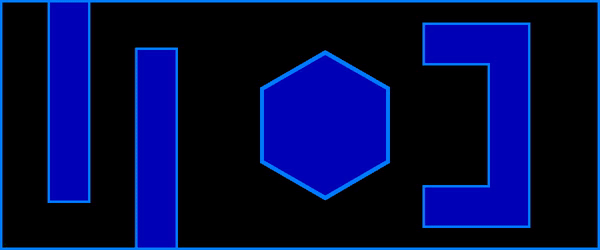
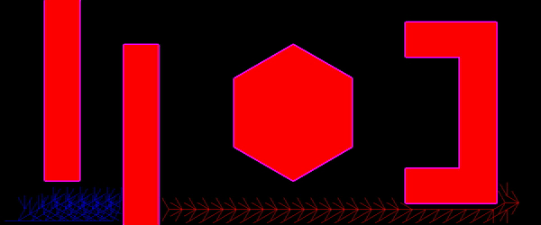

# Path Planning and Robot Navigation for Obstacle Avoidance

*Robot Path planning using Dijkstra, A-Star, and RRT.*

## Results

**Dijkstra**

  

**A-star**

**Bidirectional A-star**

(10,10) is the Start Node and (1150,50) is the Goal Node.

